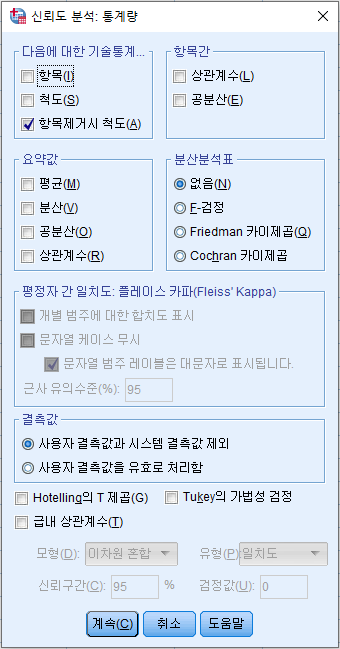
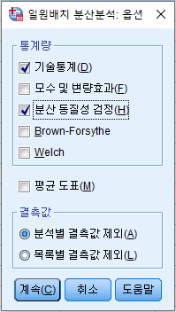
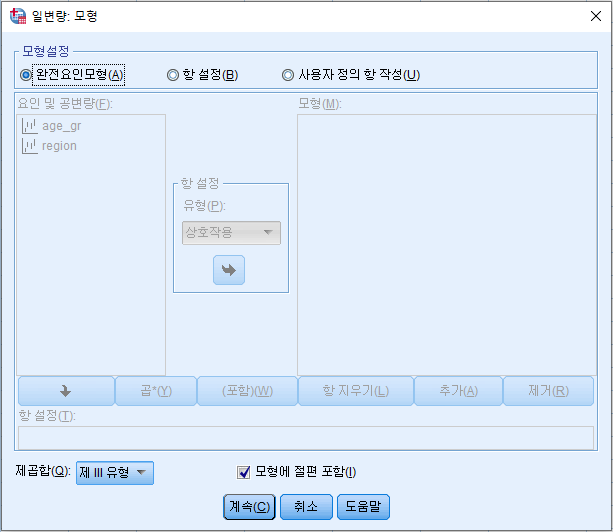
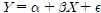
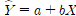
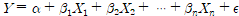
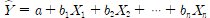

# SPSS
> IBM SPSS Statistics 26

* 초기설정

  > 편집 => 옵션

* 파일 불러오기

  > 파일 => 열기 => 데이터

  * Excel 파일

    > 변수명 유무 확인 후 진행

    * txt 로 변환

      > 파일 => 다른 이름으로 저장 => 파일 형식 - 텍스트 (탭으로 분리)

  * 텍스트 파일

    > 변수명, **구분자** 유무 확인 후 진행
    
    * 구분자에 의한 배열
    * 고정 너비로 배열
    
    

* 변수보기 설정

  * 레이블

    > 변수의 설명을 지정
    >
    > 가독성을 위해 한글 4 ~ 5자가 적당

  * 값

    > 인코딩의 역할

  * 결측값 지정

    

    * 이산형 결측값

      > 최대 3개까지 지정 가능

    * 한개의 선택적 이산형 결측값을 더한 범위

      > 3개 이상의 결측값 설정 시 사용
    
      
  
* 출력결과

  > 더블클릭 => 드래그(선택) => 우클릭 => 셀 특성 => 형식값
  >
  > ex) 범주를 숫자로 선택 후 소수점이하자리를 3으로 놓으면 4자리에서 반올림과 같음

  

#### 빈도분석

> 질적척도(명목척도, 서열척도)에서 사용
>
> 분석 => 기술통계량 => 빈도분석

> 평균, 최소값, 최대값을 산출하여 이상치, 오류값을 파악
>
> 3점 척도의 경우 평균이 2이상, 5점 척도의 경우 평균이 3이상이 적합
>
> S.E. 평균(평균의 표준오차)

#### 	역코딩

> 문항의 점수가 높을수록 긍정적인 결과가 해석상의 혼선을 방지할 수 있음

* 변수  계산 이용

  > 변환 => 변수 계산
  >
  > (척도+1) 해당 변수
  >
  > ex) 5점 척도 => 해당변수_RE = 6 - 해당변수

* 다른 변수로 코딩 변경 이용

  > 변환 => 다른 변수로 코딩 변경

  

 #### 코딩 변경

> 변환 => 다른 변수로 코딩 변경

* 그룹화

  

#### 기술통계

> 양적척도(등간척도, 비율척도)에서 사용
>
> 분석 => 기술통계량 => 기술통계
>
> 기술통계는 빈도분석과 비슷하지만 사분위수가 없고 표준화 값을 변수로 저장해주는 기능이 있음

#### 변동계수

> 서로 단위가 다른 척도(동일한 척도도 사용 가능)의 산포도를 비교할 때 사용하는 척도로, 변동계수가 작을수록 상대적으로 산포가 작다(자료의 변량이 평균에 가깝다)고 해석할 수 있음
>
> 표준편차 / 평균
>
> 소수점 6자리로 변경 후 계산

#### 교차분석(카이스퀘어/카이제곱 검정)

> 질적척도인 2개 이상의 변수에 대한 빈도의 집계표를 나타내 주는 분석방법
>
> 분석 => 기술통계량 => 교차분석
>
> 일반적으로, 상대적 기준에서 중요한 변수를 행에 위치

> 상관관계는 질적척도의 상관관계를 나타냄

* 원리

  > 기대빈도와 관찰빈도를 구함
  >
  > 계산된 검정통계량값을 이용하여, 기대빈도와 관찰빈도 간의 차이 검증
  >
  > 만약, 기대빈도와 관찰빈도의 차이가 없다면 => '독립이다'

* 가설

  > 귀무가설 : 행과 열은 서로 독립이다.(관련이 없다.)
  >
  > 대립가설 : 행과 열은 서로 독립이 아니다.(관련이 있다.)

* 자유도

  > (행-1) * (열-1)

* 유의수준 0.05 범위에서 p값이 크면 귀무가설 채택, 작으면 귀무가설 기각

  

#### 상대도수

> 각 변량의 도수 / 총 도수
>
> 해당 변수의 전체 % * 100

#### 다중반응(다중응답) 분석

> 선택 : 1
>
> 비선택 : 0
>
> 분석 => 다중반응 => 변수군 정의 => 빈도분석/교차분석

* 이분형 다중응답

  > 빈도화 값은 분석 목적에 따라 '선택(YES)' or '비선택(NO)'의 부호화를 입력해야 함
  >
  > 출력결과 => 케이스 요약의 N은 인원수를 나타내는 것이고, 빈도의 N은 건수를 나타냄

* 범주형 다중응답

  > 범위로 빈도화 값을 지정

#### 평균

* 모두 응답한 경우에 대한 평균

  > 산식을 사용
  >
  > ex) (a + b +c) / 3

* 응답 여부에 상관없는 평균

  > 함수를 사용
  >
  > ex) mean(a, b, c)

#### 신뢰도 분석

> 검사-재검사법, 동형검사, 반분법, 복수양식법, 내적 일관성 분석으로 측정 가능
>
>  일반적으로 내적 일관성 방법을 많이 사용하며,  Cronbach's alpha(크롬바하 알파) 계수를 이용
>
> Cronbach's alpha(크롬바하 알파)는 0 ~ 1까지 값을 가지며, 0.6이상이면 신뢰도가 높다고 판단
>
> 분석 => 척도분석 => 신뢰도 분석

> 항목제거시 척도를 선택하면, 신뢰도 분석 시 좋지 않은 영향을 주는 항목을 찾아낼 수 있음
>
> 출력결과 => '수정된 항목-전체 상관관계'가 0.3 이하일 경우 삭제하는 것이 일반적

#### 독립변수 t검정

> 독립변수의 **속성**이 2개인 질적 변수와 양적 종속 변수의 차이를 검정하는 분석
>
> 분석 => 평균비교 => 독립표본 T 검정
>
> 집단변수 = 독립변수, 검정변수 = 종속변수

1. Levene의 등분산 검정 확인

   > 유의확률(검정통계량 F)이 유의수준 0.05보다 작으면 귀무가설 기각
   >
   > 등분산이 가정되지 않음을 의미

   * 분산의 동실성에 대한 가설

     > 귀무가설 : 두 집단의 분산은 동일하다.
     >
     > 대립가설 : 두 집단의 분산은 동일하지 않다.

2. 유의확률 확인

   

**독립변수 t검정에서 단축 검정의 p값 구하기가 쉽지 않으므로 양측 검정의 p값에서 * (1/2)을 하여 p값을 구함**

#### 대응표본 t검정

> 독립변수, 종속변수보다는 '사전과 사후 효과'와 같이 두 변수의 차이 검정
>
> 분석 => 평균비교 => 대응표본 T 검정

#### 일원배치 분산분석

> 독릭변수의 **속성**이 3개 이상인 경우의 평균차이 검정
>
> 분석 => 평균비교 => 일원배치 분산분석

* 가설

  > 귀무가설 : 그룹별 종속변수의 평균에는 차이가 없다.
  >
  > 대립가설 최소한 하나의 그룹에서는 종속변수의 평균에는 차이가 있다.ㅌ

1. 분산의 동질성 검정

   > 유의확률이 유의수준 0.05보다 크면 귀무가설을 기각 할 수 없음
   >
   > 등분산 가정 채택
   >
   > 만약, 분산의 동질성 검정에서 유의수준 0.05보다 작으면 원칙적으로는 분산분석을 실시하면 안됨

2. ANOVA

   > 검정통계량 F, 유의확률이 유의수준 0.05보다 작으면 귀무가설 기각
   >
   > 최소한 하나의 집단에서 차이가 있다.
   >
   > 차이가 있다면 사후분석

3. 사후분석

   > 유의수준 설정 반드시 확인
   >
   > 유의수준 0.05 > 유의확률이라면, 
   >
   > 유의미한 차이가 있다로 해석

#### 이원배치 분산분석

> 독립변수가 2개이며, 각 독립변수의 속성이 2개 이상인 경우의 평균차이 검정

* 반복측정이 있는 이원배치 분산분석

  > 상호작용(교호작용) 있음
  >
  > 분석 => 일반선형모형 => 일변량

  

  > 완전요인모형을 선택하면 반복이 있는 이원배치 분산분석

  1. 오차 분산의 동일성에 대한 Levene의 검정 확인(등분산 가정)

     > 귀무가설 : 독립변수1, 독립변수2 모든 집단 오차의 분산은 동일하다.
     >
     > 대립가설 : 독립변수1, 독립변수2의 최소한 하나 집단의 분산은 동일하지 않다.

  2. 개체-간 효과 검정(모형의 타당성 검정)

     > 수정된 모형의 유의확률 확인
     >
     > 귀무가설 : 독립변수와 상호작용 변수는 종속변수를 설명하지 못한다.(모형은 유의하지 않다.)
     >
     > 대립가설 : 독립변수와 상호작용 변수는 종속변수를 설명한다.(모형은 유의하다.)

  3. 개체-간 효과 검정(상호작용 효과 검정)

     > 독립변수1*독립변수2의 유의확률 확인
     >
     > 귀무가설 : 독립변수1, 독립변수2 변수 간의 상호 작용 효과는 없다.
     >
     > 대립가설 : 독립변수1, 독립변수2 변수 간의 상호 작용 효과가 있다.

  4. 개체-간 효과 검정(독립변수들의 유의성 검정)

* 반복측정이 없는 이원배치 분산분석

  > 상호작용(교호작용) 없음
  >
  > 분석 => 일반선형모형 => 일변량
  >
  > 사용자 정의 항 작성을 선택하면 반복이 없는 이원배치 분산분석

  **사용자 정의에 모형 추가 시 하나씩 선택 후 이동**

  1. 오차 분산의 동일성에 대한 Levene의 검정 확인(등분산 가정)

     > 귀무가설 : 모든 변수들의 분산은 동일하다.
     >
     > 대립가설 최소한 하나의 변수의 분산은 동일하지 않다.

  2. 개체-간 효과 검정(모형의 타당성 검정)

     > 수정된 모형의 유의확률 확인
     >
     > 귀무가설 : 독립변수와 상호작용 변수는 종속변수를 설명하지 못한다.(모형은 유의하지 않다.)
     >
     > 대립가설 : 독립변수와 상호작용 변수는 종속변수를 설명한다.(모형은 유의하다.)

  3. 개체-간 효과 검정(독립변수들의 유의성 검정)

  4. 사후 분석

     > 유의한 변수만 사후분석

#### 상관분석

> 변수들과 변수 사이의 관계를 분석하는 방법
>
> 변수들을 독립변수와 종속변수로 구분하지 않고 두 변수 사이의 1차 선형관계 강도만을 상관계수의 수치로 분석
>
> 분석 => 상관분석 => 이변량 상관

* 상관계수값 해석

  > 0.20 이하 : 상관관계가 없다
  >
  > 0.20 ~ 0.40 : 약한상관 관계
  >
  > 0.40 ~ 0.60 : 보통 수준의 상관 관계
  >
  > 0.60 ~ 0.80 : 높은 수준의 상관 관계
  >
  > 0.80 이상 : 강한 상관 관계

1. 유의확률과 유의수준 비교후 귀무가설 기각 여부 결정
2. 상관계수 값을 통하여 부호와 상관의 정도 파악

#### 단순 회귀분석

> 독립변수(설명변수)가 하나일 경우
>
> 분석 => 회귀분석 => 선형

* 회귀모형

  >     
  >
  > 종속변수 = 상수 + 회귀계수(기울기)*독립변수 + 오차항

* 회귀식

  >     

#### 다중 회귀분석

> 독립변수(설명변수)가 2개 이상일 경우

* 회귀모형

  >     
  >
  > 종속변수 = 상수 + 회귀계수(기울기)*독립변수 + 오차항

* 회귀식

  >     