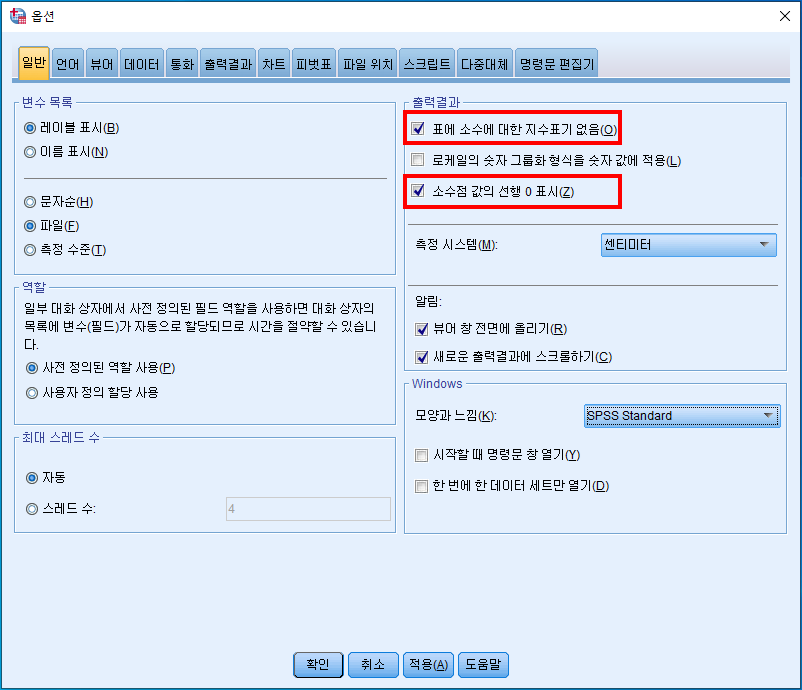
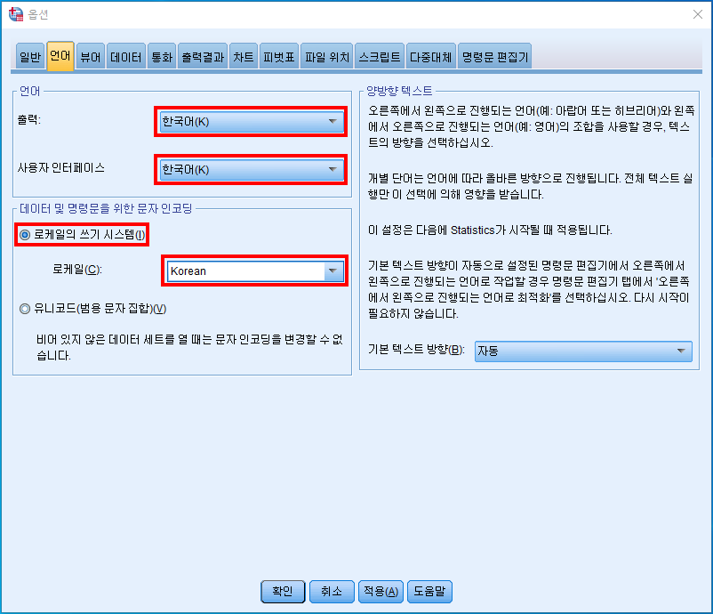
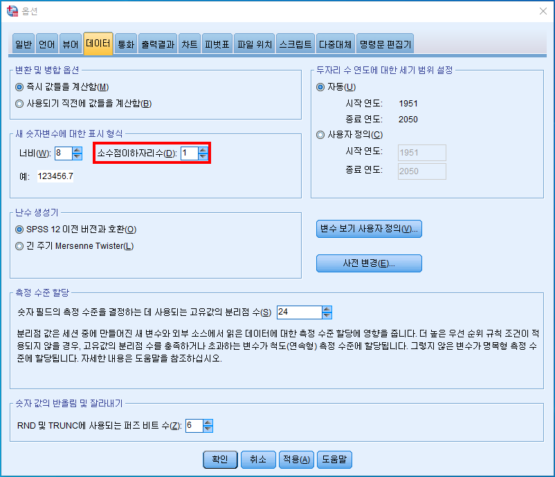
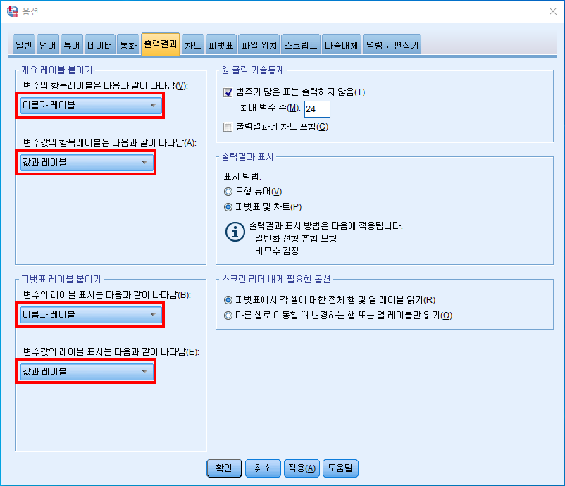
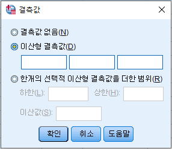
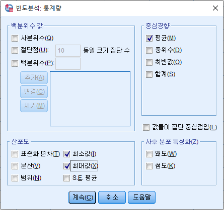
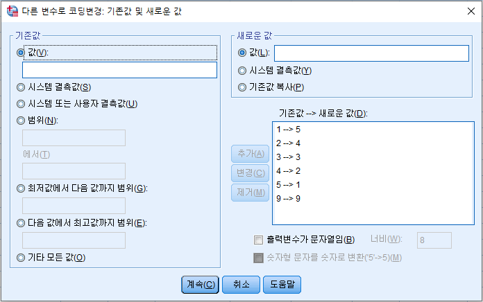
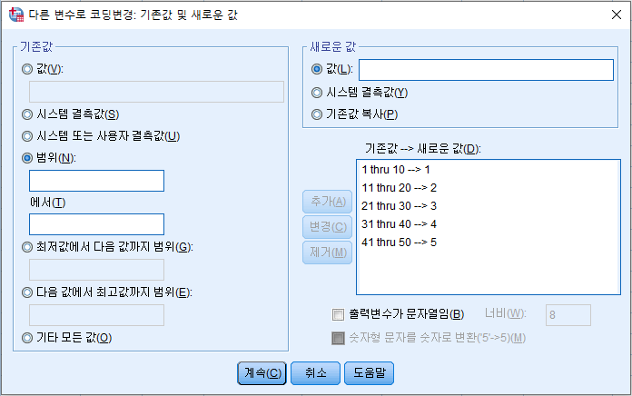
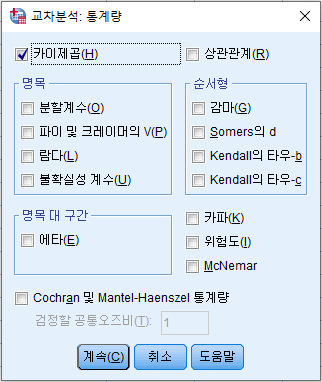

# SPSS
> IBM SPSS Statistics 26

* 초기설정

  > 편집 => 옵션

* 파일 불러오기

  > 파일 => 열기 => 데이터

  * Excel 파일

    > 변수명 유무 확인 후 진행

    * txt 로 변환

      > 파일 => 다른 이름으로 저장 => 파일 형식 - 텍스트 (탭으로 분리)

  * 텍스트 파일

    > 변수명, **구분자** 유무 확인 후 진행
    
    * 구분자에 의한 배열
    * 고정 너비로 배열
    
    

* 변수보기 설정

  * 레이블

    > 변수의 설명을 지정
    >
    > 가독성을 위해 한글 4 ~ 5자가 적당

  * 값

    > 인코딩의 역할

  * 결측값 지정

    

    * 이산형 결측값

      > 최대 3개까지 지정 가능

    * 한개의 선택적 이산형 결측값을 더한 범위

      > 3개 이상의 결측값 설정 시 사용
    
      
  
* 출력결과

  > 더블클릭 => 드래그(선택) => 우클릭 => 셀 특성 => 형식값
  >
  > ex) 범주를 숫자로 선택 후 소수점이하자리를 3으로 놓으면 4자리에서 반올림과 같음

  

#### 빈도분석

> 질적척도(명목척도, 서열척도)에서 사용
>
> 분석 => 기술통계량 => 빈도분석

> 평균, 최소값, 최대값을 산출하여 이상치, 오류값을 파악
>
> 3점 척도의 경우 평균이 2이상, 5점 척도의 경우 평균이 3이상이 적합
>
> S.E. 평균(평균의 표준오차)

#### 	역코딩

> 문항의 점수가 높을수록 긍정적인 결과가 해석상의 혼선을 방지할 수 있음

* 변수  계산 이용

  > 변환 => 변수 계산
  >
  > (척도+1) 해당 변수
  >
  > ex) 5점 척도 => 해당변수_RE = 6 - 해당변수

* 다른 변수로 코딩 변경 이용

  > 변환 => 다른 변수로 코딩 변경

  

 #### 코딩 변경

> 변환 => 다른 변수로 코딩 변경

* 그룹화

  

#### 기술통계

> 양적척도(등간척도, 비율척도)에서 사용
>
> 분석 => 기술통계량 => 기술통계
>
> 기술통계는 빈도분석과 비슷하지만 사분위수가 없고 표준화 값을 변수로 저장해주는 기능이 있음

#### 변동계수

> 서로 단위가 다른 척도(동일한 척도도 사용 가능)의 산포도를 비교할 때 사용하는 척도로, 변동계수가 작을수록 상대적으로 산포가 작다(자료의 변량이 평균에 가깝다)고 해석할 수 있음
>
> 표준편차 / 평균
>
> 소수점 6자리로 변경 후 계산

#### 교차분석(카이스퀘어/카이제곱 검정)

> 질적척도인 2개 이상의 변수에 대한 빈도의 집계표를 나타내 주는 분석방법
>
> 분석 => 기술통계량 => 교차분석
>
> 일반적으로, 상대적 기준에서 중요한 변수를 행에 위치

> 상관관계는 질적척도의 상관관계를 나타냄

* 원리

  > 기대빈도와 관찰빈도를 구함
  >
  > 계산된 검정통계량값을 이용하여, 기대빈도와 관찰빈도 간의 차이 검증
  >
  > 만약, 기대빈도와 관찰빈도의 차이가 없다면 => '독립이다'

* 가설

  > 귀무가설 : 행과 열은 서로 독립이다.(관련이 없다.)
  >
  > 대립가설 : 행과 열은 서로 독립이 아니다.(관련이 있다.)

* 자유도

  > (행-1) * (열-1)

* 유의수준 0.05 범위에서 p값이 크면 귀무가설 채택, 작으면 귀무가설 기각

  

#### 상대도수

> 각 변량의 도수 / 총 도수
>
> 해당 변수의 전체 % * 100

#### 다중반응(다중응답) 분석

> 선택 : 1
>
> 비선택 : 0
>
> 분석 => 다중반응 => 변수군 정의

* 이분형 다중응답

  > 빈도화 값은 분석 목적에 따라 '선택(YES)' or '비선택(NO)'의 부호화를 입력해야 함
  >
  > 출력결과 => 케이스 요약의 N은 인원수를 나타내는 것이고, 빈도의 N은 건수를 나타냄

* 범주형 다중응답

  > 범위로 빈도화 값을 지정

